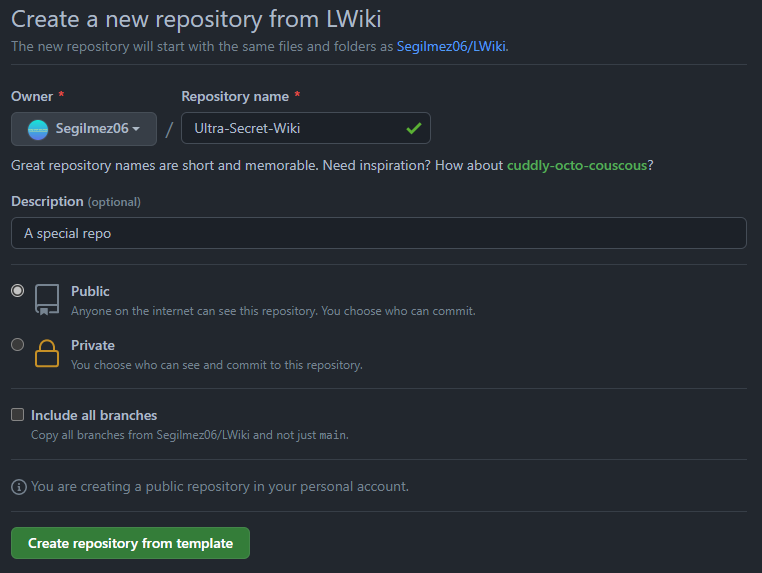
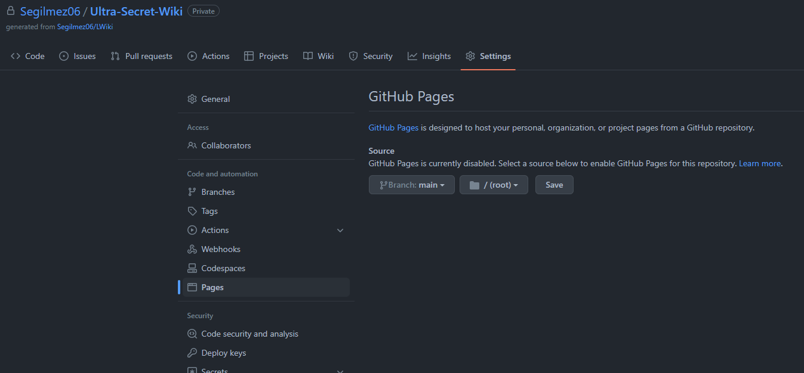

# LWiki

LWiki is a simple Wiki software designed to be used with Github Pages.

## Installation

1) Click the green "Use this template" button.

[](https://github.com/Segilmez06/LWiki/generate)

2) Fill the form to generate repo.



3) Enable Github Pages on `main` branch with `root` directory.



## Configration

LWiki can have 2 special pages: Home page, 404 page. This pages can be assigned in settings file.
### Configration:
- `name`: This string is visible in top bar.
- `pageDirectory`: Directory that contains pages. Special pages also must be here.
- `default`: Name of home page.
- `pageType`: File extensions of pages. Markdown is preferred.
- `notFoundPage`: Name of page that is shown when page is not found.
- `topLinks`: Array of links that are shown in top bar.
    - `name`: Name of link.
    - `page`: Name of page that is linked.
    
This settings are in `settings.json`.
Here is a example configration:
```json
{
    "name": "LWiki Beta",
    "pageDirectory": "pages",
    "default": "main",
    "pageType": "md",
    "notFoundPage": "404",
    "topLinks": [
        {
            "name": "Home",
            "page": "main"
        },
        {
            "name": "Text Demo",
            "page": "demo"
        }
    ]
}
```
